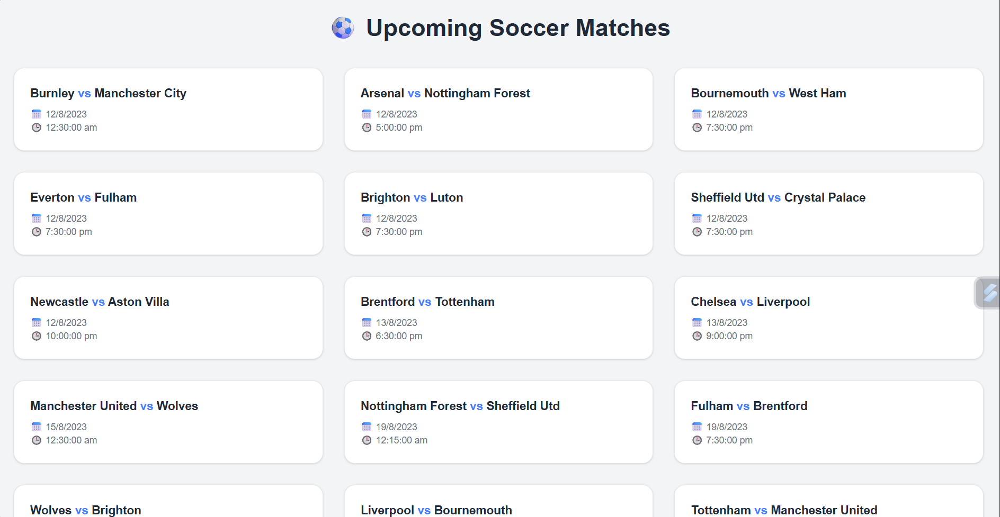
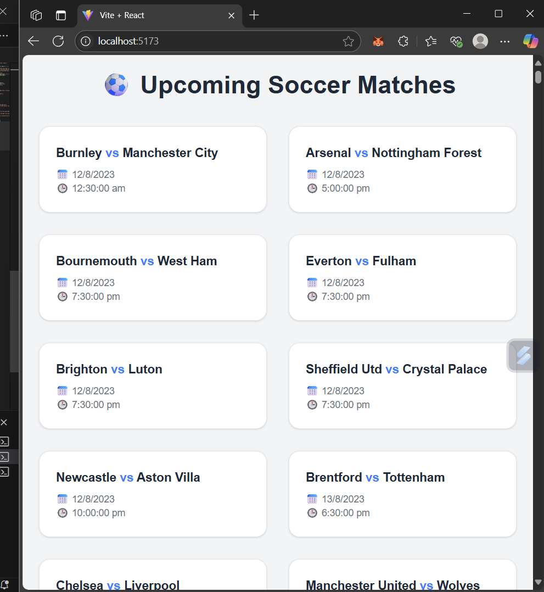

# ⚽ Soccer Match Viewer Web App

A responsive React + Express web application that fetches and displays upcoming Premier League soccer matches using the API-SPORTS Football API.

---

## 📸 Preview

### Home Page - Match Cards Displayed



### Responsive Layout on Different Screen Sizes



---

## 🚀 Features

- Fetches real-time Premier League match data from the Football API
- Displays match information (teams, date, time)
- Responsive grid layout (1-3 columns depending on screen size)
- Smooth hover effects with shadow and border highlight
- Fully styled using Tailwind CSS

---

## 🛠 Tech Stack

- **Frontend:** React, Tailwind CSS
- **Backend:** Node.js, Express
- **API:** [API-SPORTS Football API](https://www.api-football.com/)
- **Other:** Axios, CORS, dotenv

---

## 📦 Installation & Setup

### 1. Clone the repository

```bash
git clone https://github.com/ShivPandey5677/SportsOrca_UpcomingMatches.git
cd soccer-match-viewer
```

### 2. Install backend dependencies

```bash
cd backend
npm install
```

Create a `.env` file inside `backend/`:

```env
API_FOOTBALL_KEY=your_api_football_key_here
```

### 3. Start the backend server

```bash
cd backend
npm install
nodemon server.js
```

Server will run at `http://localhost:5000`

---

### 4. Setup frontend

```bash
cd frontend
npm install
npm run dev
```

Frontend will run at `http://localhost:5173` (if using Vite)

---

## 🔧 Project Structure

```
soccer-match-viewer/
│
├── backend/
│   ├── server.js
│   └── .env
│
├── frontend/
│   ├── src/
│   │   └── App.jsx
│   ├── index.css
│   └── tailwind.config.js
|──fullscreen.png
└──responsive.png

```

---

## 📝 License

This project is for academic purposes only.

---

## ✍️ Author

**Your Name**  
Shiv Pandey
